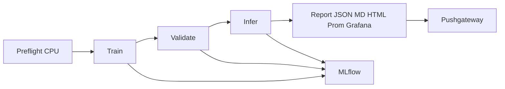

# Poker YOLO

Сквозной пайплайн на **Ultralytics YOLOv8 (classify)** для распознавания **покерных комбинаций** (10 классов: от `high_card` до `royal_flush`). Обучение — Kaggle MRPH; оценка на реальных столах — **hands benchmark** (`dataset/test/images`).

- Постановка задачи: [docs/TASK.md](docs/TASK.md)
- **Справочник всех метрик** (MLflow, Grafana, HTML): **[docs/METRICS.md](docs/METRICS.md)**

---

## Содержание

1. [Быстрый старт](#быстрый-старт)
2. [CLI](#cli)
3. [Пайплайн](#пайплайн)
4. [Конфигурация](#конфигурация)
5. [Отчёты и observability](#отчёты-и-observability)
6. [Docker](#docker)
7. [Разработка](#разработка)
8. [Troubleshooting](#troubleshooting)

---

## Быстрый старт

```bash
git clone <URL> poker-yolo && cd poker-yolo
uv sync
cp .env.example .env
```

**Docker (полный `train`):**

```bash
docker compose up -d mlflow
docker compose --profile observability up -d   # опционально
docker compose build poker-yolo
docker compose run --rm poker-yolo --config configs/default.yaml train
```

**Результаты на хосте** (volume `./runs`):

| Артефакт | Путь |
|----------|------|
| Веса | `runs/classify/runs/train/<name>/weights/best.pt` |
| JSON-отчёт | `runs/reports/latest.json` |
| HTML-отчёт | `runs/reports/latest.html` |
| Markdown | `runs/reports/latest.md` |
| Grafana JSON | `runs/reports/grafana/*.json` |

```powershell
start runs\reports\latest.html
```

## CLI

| Подкоманда | Назначение |
|------------|------------|
| `train` | Preflight → train → validate → infer → отчёты |
| `validate` | Только val на Kaggle |
| `infer` | Только predict по `infer.source` |
| `html-report` | HTML из `latest.json` или `--report-json` |

Флаги `train`: `--skip-infer`, `--skip-preflight`, `--infer-source`, `--no-save`.

Утилита **`poker-hand`** — комбинация на одном фото (детекция карт + `evaluate_hand`).

---

## Пайплайн



| Шаг | Данные | Что пишется |
|-----|--------|-------------|
| Train | Kaggle `data.yaml` | `results.csv` → кривые; `train_*`; MLflow по эпохам |
| Validate | Kaggle val | `val_*` |
| Infer | `infer.source` | `infer_*`, hands benchmark, preview |
| Report | агрегация | `latest.json`, HTML, Pushgateway |

Модули: `cli.py`, `train.py`, `validate.py`, `infer.py`, `pipeline.py`, `reporting.py`, `html_report.py` — см. [docs/METRICS.md](docs/METRICS.md) для полей каждого выхода.

---

## Конфигурация

| Файл | Эпохи | Назначение |
|------|-------|------------|
| `configs/smoke.yaml` | 3, CPU | Smoke |
| `configs/local.yaml` | 5 | Короткие прогоны |
| `configs/default.yaml` | 50 | Основное обучение |
| `configs/hands.yaml` | — | `poker-hand` |

Секции: `data`, `benchmark`, `model`, `train`, `augmentations`, `validate`, `infer`, `mlflow`, `reporting`.

Переменные: **`.env.example`** (`KAGGLE_*`, `MLFLOW_*`, `PROMETHEUS_*`, `*_PORT`, `REQUIRE_CUDA`, …).

---

## Отчёты и observability

### Файлы отчёта

| Формат | Файл | Назначение |
|--------|------|------------|
| JSON | `latest.json` | Источник правды для HTML/Grafana backfill |
| HTML | `latest.html` | Интерактивный отчёт (Chart.js, benchmark, превью) |
| Markdown | `latest.md` | Текстовый отчёт |
| Prometheus | `latest.prom` | Pushgateway → Grafana KPI |

Подробное описание **каждой метрики и поля** — в **[docs/METRICS.md](docs/METRICS.md)** (разделы MLflow / Grafana / HTML).

### MLflow

`http://localhost:<MLFLOW_PORT>` — отдельный run на фазу, параметры конфига, метрики по эпохам (`epoch_*`), итоги train/val/infer, артефакты `best.pt` и `results.csv`.

### Grafana (profile `observability`)

| Дашборд | UID | Данные |
|---------|-----|--------|
| Training curves | `poker-yolo-curves` | Infinity: `training_curves.json` |
| Training metrics | `poker-yolo-training` | Prometheus: CPU, RAM, duration, val top-1/top-5 |
| Benchmark & inference | `poker-yolo-inference` | Prometheus KPI + outcomes + confusion + preview |

---

## Docker

```bash
docker compose up -d mlflow
docker compose build poker-yolo
docker compose run --rm poker-yolo --config configs/local.yaml train
docker compose run --rm poker-yolo check-gpu
```

GPU: NVIDIA Container Toolkit; **`shm_size: 8gb`**; entrypoint: `poker-yolo --config <yaml> <command>`.

Скрипт Windows: **`scripts/run_full_train.ps1`**.

---

## Разработка

```bash
uv sync --group dev
uv run pytest
```

```
.
├── poker_yolo/       # код пайплайна
├── configs/
├── docs/
│   └── METRICS.md    # справочник метрик
│   └── TASK.md
├── dataset/
├── observability/
├── scripts/
└── tests/
```

---
