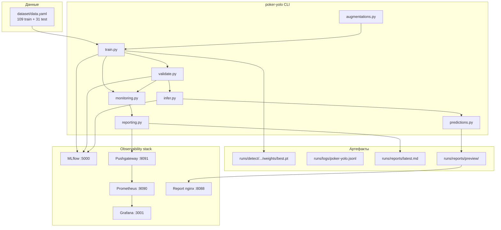

# Poker YOLO — детекция игральных карт

End-to-end пайплайн на **YOLOv8** для обнаружения и классификации 52 классов игральных карт. Включает обучение, валидацию, инференс, логирование в MLflow, структурированные отчёты и опциональный стек observability (Prometheus + Grafana).

Подробное описание задачи и целевых метрик — в [TASK.md](TASK.md).

---

## Содержание

- [Архитектура](#архитектура)
- [Компоненты проекта](#компоненты-проекта)
- [Требования](#требования)
- [Быстрый старт на новом ПК](#быстрый-старт-на-новом-пк)
- [Один запуск — весь пайплайн](#один-запуск--весь-пайплайн)
- [Просмотр результатов](#просмотр-результатов)
- [Отдельные команды (опционально)](#отдельные-команды-опционально)
- [Конфигурации](#конфигурации)
- [Docker](#docker)
- [Тесты](#тесты)
- [Структура каталогов](#структура-каталогов)
- [Troubleshooting](#troubleshooting)

---

## Архитектура



**Поток команды `train`:**

1. Загрузка конфига YAML → старт отчёта
2. **Обучение** YOLOv8 с on-the-fly аугментациями
3. **Валидация** на test split (mAP, F1, Precision, Recall)
4. **Инференс** на `infer.source` (по умолчанию `dataset/test/images`)
5. Экспорт 3 preview-изображений для отчётов и Grafana
6. Финальный отчёт (JSON / Markdown / Prometheus) + ссылки в консоли
7. Логирование в MLflow

---

## Компоненты проекта

| Компонент | Путь / сервис | Назначение |
|-----------|---------------|------------|
| CLI | `poker_yolo/cli.py` | Точка входа: `train`, `validate`, `infer` |
| Обучение | `poker_yolo/train.py` | Ultralytics YOLOv8 + MLflow callbacks |
| Валидация | `poker_yolo/validate.py` | mAP, Precision, Recall, F1 на test |
| Инференс | `poker_yolo/infer.py` | Предсказания на файлах/папках |
| Аугментации | `poker_yolo/augmentations.py` | Mosaic/MixUp + Albumentations |
| Мониторинг | `poker_yolo/monitoring.py` | CPU/GPU/RAM, статистика аугментаций |
| Preview | `poker_yolo/predictions.py` | 3 аннотированных примера для отчётов |
| Отчёты | `poker_yolo/reporting.py` | JSON / MD / Prometheus + Pushgateway |
| MLflow | `poker_yolo/mlflow_utils.py` | Эксперименты, параметры, метрики, веса |
| Конфиги | `configs/*.yaml` | Параметры train/val/infer/reporting |
| Датасет | `dataset/` | YOLO-разметка, 52 класса |
| Docker | `Dockerfile`, `docker-compose.yml` | Контейнер пайплайна + MLflow + Grafana |
| Observability | `observability/` | Prometheus, Grafana dashboards, nginx |

---

## Требования

### Локальная разработка

| Требование | Версия |
|------------|--------|
| Python | ≥ 3.11 |
| [uv](https://docs.astral.sh/uv/) | последняя |
| Git | любая актуальная |
| GPU (опционально) | CUDA + драйвер NVIDIA |

### Docker (полный стек)

- Docker Desktop / Docker Engine
- Docker Compose v2
- Для GPU в контейнере: [NVIDIA Container Toolkit](https://docs.nvidia.com/datacenter/cloud-native/container-toolkit/install-guide.html)

---

## Быстрый старт на новом ПК

### 1. Клонировать репозиторий

```bash
git clone <URL-репозитория> poker-yolo
cd poker-yolo
```

### 2. Проверить датасет

Датасет включён в репозиторий (`dataset/`, ~75 MB). Если каталога нет — экспортируйте YOLOv8-датасет из [Roboflow](https://roboflow.com) и распакуйте в `dataset/`. Структура:

```
dataset/
  data.yaml
  train/images/   train/labels/
  test/images/    test/labels/
```

> **Важно:** в `dataset/data.yaml` не должно быть строки `path: .` — пути задаются относительно расположения файла.

### 3. Установить зависимости

```bash
# Windows (PowerShell) / Linux / macOS
uv sync
```

При первом запуске Ultralytics автоматически скачает базовые веса `yolov8n.pt` (~6 MB).

### 4. Поднять сервисы (рекомендуется до обучения)

```bash
docker compose up -d mlflow
docker compose --profile observability up -d   # Grafana + Prometheus + preview nginx
```

| Сервис | URL | Логин |
|--------|-----|-------|
| MLflow | http://localhost:5000 | — |
| Grafana | http://localhost:3001 | admin / admin |
| Preview-изображения | http://localhost:8088/preview/ | — |

### 5. Запустить весь пайплайн одной командой

```bash
# Smoke test (~5 мин на CPU): train → validate → infer → отчёт
uv run poker-yolo --config configs/smoke.yaml train

# Локальная разработка (10 эпох)
uv run poker-yolo --config configs/local.yaml train

# Полное обучение (50 эпох)
uv run poker-yolo --config configs/default.yaml train
```

После завершения в консоли появится блок **«Pipeline complete — where to view results»** со ссылками на отчёт, веса, MLflow и Grafana.

На машине **без GPU** `device: auto` автоматически переключается на `cpu`.

---

## Один запуск — весь пайплайн

```bash
uv run poker-yolo --config configs/default.yaml train
```

| Шаг | Что происходит |
|-----|----------------|
| 1. Train | Обучение YOLOv8, логирование метрик по эпохам |
| 2. Validate | mAP@0.5, F1, Precision, Recall на test |
| 3. Infer | Предсказания на `infer.source` (по умолчанию test/images) |
| 4. Report | JSON + Markdown + Prometheus + 3 preview-картинки |

### Опции

```bash
# Пропустить инференс (только train + validate)
uv run poker-yolo --config configs/local.yaml train --skip-infer

# Другой источник для инференса
uv run poker-yolo --config configs/local.yaml train --infer-source path/to/images

# Не сохранять аннотированные картинки инференса
uv run poker-yolo --config configs/local.yaml train --no-save
```

### Что создаётся

| Артефакт | Путь |
|----------|------|
| Лучшие веса | `runs/detect/runs/train/<name>/weights/best.pt` |
| CSV метрик обучения | `runs/detect/runs/train/<name>/results.csv` |
| Аннотированный инференс | `runs/infer/pred_<timestamp>/` |
| Отчёт | `runs/reports/latest.md` |
| Preview (3 img) | `runs/reports/preview/sample_{0,1,2}.jpg` |
| Структурированный лог | `runs/logs/poker-yolo.jsonl` |

### Переменные окружения

| Переменная | Описание | Пример |
|------------|----------|--------|
| `MLFLOW_TRACKING_URI` | URI MLflow | `http://localhost:5000` |
| `PROMETHEUS_PUSHGATEWAY_URL` | Pushgateway для Grafana | `http://localhost:9091` |

---

## Просмотр результатов

После `train` смотрите результаты в трёх местах:

### 1. Локальный отчёт (сразу после запуска)

```bash
# Windows
type runs\reports\latest.md

# Linux / macOS
cat runs/reports/latest.md
```

Содержит: метрики val/infer, CPU/RAM/GPU, статистику аугментаций, preview-ссылки, production KPI.

### 2. MLflow

1. Откройте **http://localhost:5000**
2. Эксперимент **`poker-yolo`**
3. В run'ах: parameters, metrics по эпохам, артефакты (`best.pt`, `results.csv`, predictions)

### 3. Grafana

1. **http://localhost:3001** (admin / admin)
2. Dashboard: **Poker YOLO — Training and Inference**
3. Preview-картинки также на **http://localhost:8088/preview/**

> Observability stack должен быть запущен **до** обучения, чтобы метрики попали в Grafana через Pushgateway.

---

## Отдельные команды (опционально)

Если модель уже обучена, можно запускать шаги по отдельности:

```bash
# Только валидация
uv run poker-yolo --config configs/local.yaml validate \
  --weights runs/detect/runs/train/poker_cards/weights/best.pt

# Только инференс
uv run poker-yolo --config configs/local.yaml infer \
  --weights runs/detect/runs/train/poker_cards/weights/best.pt \
  --source dataset/test/images
```

Если `--weights` не указан, CLI ищет `best.pt` в стандартных путях.

---

## Конфигурации

| Файл | Назначение |
|------|------------|
| `configs/default.yaml` | Полное обучение: 50 эпох, все аугментации |
| `configs/local.yaml` | Локальная разработка: 10 эпох, MLflow на localhost |
| `configs/smoke.yaml` | Smoke test: 3 эпохи, CPU, быстрая проверка CI |

Ключевые секции YAML:

```yaml
data:          # пути к data.yaml и корню датасета
model:         # yolov8n.pt, imgsz
train:         # epochs, batch, device, lr, project/name
augmentations: # mosaic, mixup, albumentations
validate:      # conf, iou, split
infer:         # conf, iou, save_dir, source (папка для инференса в пайплайне)
mlflow:        # tracking_uri, experiment_name
reporting:     # log_dir, report_dir, pushgateway_url, preview_samples
```

---

## Docker

```bash
docker compose up -d mlflow
docker compose --profile observability up -d
docker compose build poker-yolo
docker compose run --rm poker-yolo train --config configs/default.yaml
```

Команда `train` в контейнере запускает полный пайплайн (train → validate → infer → report).

Для GPU раскомментируйте секцию `deploy.resources` в `docker-compose.yml`.

---

## Тесты

```bash
uv sync --group dev
uv run pytest
```

61 тест: конфиг, аугментации, CLI, pipeline (mocked YOLO), reporting, monitoring, predictions.

---

## Структура каталогов

```
.
├── poker_yolo/           # Python-пакет пайплайна
├── configs/              # YAML-конфиги
├── dataset/              # YOLO датасет (train/test)
├── observability/        # Prometheus, Grafana, nginx
├── scripts/              # entrypoint.sh, run_full_train.ps1
├── tests/                # pytest
├── Dockerfile
├── docker-compose.yml
├── pyproject.toml
├── uv.lock               # зафиксированные версии зависимостей
├── TASK.md               # постановка задачи и метрики
└── README.md             # это руководство
```

**Не коммитится** (см. `.gitignore`): `runs/`, `mlruns/`, `.venv/`, `*.pt`, кэши.

---

## Troubleshooting

| Проблема | Решение |
|----------|---------|
| `device=auto` без GPU | Автоматически → `cpu`; или явно `device: cpu` в YAML |
| MLflow недоступен | `docker compose up -d mlflow` или `MLFLOW_TRACKING_URI=file:///./mlruns` |
| Grafana пустая | Запустите observability profile; выполните train после старта Pushgateway |
| Веса не найдены | Проверьте `runs/detect/runs/train/<name>/weights/best.pt` |
| Ultralytics сохраняет не туда | Ultralytics пишет в `runs/detect/runs/train/`, не в `runs/train/` |
| Нет места на диске C: (Windows) | Перенесите TEMP/кэш на другой диск: `$env:TEMP="D:\tmp"` |
| Тесты зависают | Убедитесь, что `PROMETHEUS_PUSHGATEWAY_URL` не указывает на недоступный хост |

---

## Публикация в Git

```bash
git init
git add .
git status          # убедитесь: нет runs/, .venv/, *.pt
git commit -m "Initial commit: YOLOv8 poker card detection pipeline"
git remote add origin <URL>
git push -u origin main
```

> Датасет помечен как **Private** в Roboflow. Перед публикацией в публичный репозиторий убедитесь, что у вас есть право на распространение данных.
