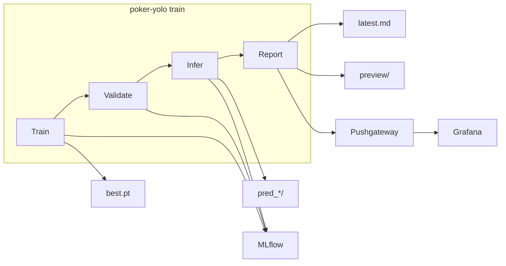

# Poker YOLO — детекция игральных карт

End-to-end пайплайн на **YOLOv8** для обнаружения и классификации 52 классов игральных карт.

**Одна команда `train`** запускает полный цикл: обучение → валидация → инференс → отчёт. Дополнительно: MLflow, структурированные логи, Prometheus/Grafana observability.

Постановка задачи и целевые метрики — в [TASK.md](TASK.md).

---

## Содержание

- [CLI](#cli)
- [Быстрый старт](#быстрый-старт)
- [Архитектура](#архитектура)
- [Компоненты](#компоненты)
- [Конфигурации](#конфигурации)
- [Просмотр результатов](#просмотр-результатов)
- [Docker](#docker)
- [Тесты](#тесты)
- [Структура каталогов](#структура-каталогов)
- [Troubleshooting](#troubleshooting)

---

## CLI

| Команда | Описание |
|---------|----------|
| `train` | Полный пайплайн: train → validate → infer → report |
| `validate` | Только валидация (нужны веса) |
| `infer` | Только инференс (нужны веса и `--source`) |

```bash
uv run poker-yolo --config <config.yaml> train [OPTIONS]
```

**Опции `train`:**

| Флаг | Описание |
|------|----------|
| `--skip-infer` | Пропустить инференс |
| `--infer-source PATH` | Папка для инференса (по умолчанию: `infer.source` в YAML) |
| `--no-save` | Не сохранять аннотированные изображения инференса |

**Глобальные опции:** `--config PATH` (по умолчанию `configs/default.yaml`).

---

## Быстрый старт

### 1. Клонировать и установить

```bash
git clone <URL> poker-yolo && cd poker-yolo
uv sync
```

При первом запуске Ultralytics скачает `yolov8n.pt` (~6 MB).

### 2. Проверить датасет

```
dataset/
  data.yaml
  train/images/   train/labels/
  test/images/    test/labels/
```

Датасет включён в репозиторий (~75 MB). В `dataset/data.yaml` **не должно** быть строки `path: .`.

### 3. Поднять сервисы

```bash
docker compose up -d mlflow
docker compose --profile observability up -d   # Grafana, Prometheus, preview nginx
```

| Сервис | URL | Логин |
|--------|-----|-------|
| MLflow | http://localhost:5000 | — |
| Grafana | http://localhost:3001 | admin / admin |
| Preview | http://localhost:8088/preview/ | — |
| Prometheus | http://localhost:9090 | — |

### 4. Запустить пайплайн

```bash
# Smoke test (~5 мин, CPU)
uv run poker-yolo --config configs/smoke.yaml train

# Локальная разработка (10 эпох)
uv run poker-yolo --config configs/local.yaml train

# Полное обучение (50 эпох)
uv run poker-yolo --config configs/default.yaml train
```

После завершения в консоли появится блок **«Pipeline complete — where to view results»**.

> Без GPU `device: auto` автоматически переключается на `cpu`.
> Для локального запуска используйте `configs/local.yaml` (MLflow на `localhost:5000`).

---

## Архитектура



**Шаги команды `train`:**

1. Обучение YOLOv8 с on-the-fly аугментациями (YOLO + Albumentations)
2. Валидация на test split — mAP, F1, Precision, Recall
3. Инференс на `infer.source` (по умолчанию `dataset/test/images`)
4. Экспорт 3 preview-изображений, финальный отчёт, push метрик в Grafana

---

## Компоненты

| Модуль | Назначение |
|--------|------------|
| `cli.py` | Точка входа: `train`, `validate`, `infer` |
| `train.py` | Обучение YOLOv8 + MLflow callbacks + мониторинг ресурсов |
| `validate.py` | mAP, Precision, Recall, F1 на test |
| `infer.py` | Предсказания на файлах/папках |
| `augmentations.py` | Mosaic/MixUp/Copy-Paste + Albumentations |
| `monitoring.py` | CPU/GPU/RAM, статистика аугментаций, production KPI |
| `predictions.py` | 3 аннотированных preview для отчётов/Grafana |
| `reporting.py` | JSON / Markdown / Prometheus → Pushgateway |
| `callbacks.py` | MLflow logging по эпохам |
| `mlflow_utils.py` | Эксперименты, параметры, артефакты |
| `logging_config.py` | JSONL-логи → `runs/logs/` |
| `config.py` | Загрузка YAML-конфигов |

**Инфраструктура:** `Dockerfile`, `docker-compose.yml`, `observability/` (Prometheus, Grafana, nginx).

---

## Конфигурации

| Файл | Эпохи | Device | MLflow | Назначение |
|------|-------|--------|--------|------------|
| `configs/smoke.yaml` | 3 | cpu | localhost | Smoke test |
| `configs/local.yaml` | 10 | auto | localhost | Локальная разработка |
| `configs/default.yaml` | 50 | auto | mlflow (Docker) | Полное обучение |

Секции YAML:

```yaml
data:          # yaml_path, dataset_root
model:         # weights, imgsz
train:         # epochs, batch, device, project/name
augmentations: # mosaic, mixup, albumentations
validate:      # conf, iou, split
infer:         # conf, iou, save_dir, source
mlflow:        # tracking_uri, experiment_name
reporting:     # log_dir, report_dir, pushgateway_url, preview_samples
```

### Переменные окружения

| Переменная | Описание | Пример |
|------------|----------|--------|
| `MLFLOW_TRACKING_URI` | URI MLflow | `http://localhost:5000` |
| `PROMETHEUS_PUSHGATEWAY_URL` | Pushgateway | `http://localhost:9091` |
| `REPORTS_BASE_URL` | URL preview в отчётах | `http://localhost:8088` |

### Артефакты после `train`

| Артефакт | Путь |
|----------|------|
| Веса | `runs/detect/runs/train/<name>/weights/best.pt` |
| CSV метрик | `runs/detect/runs/train/<name>/results.csv` |
| Инференс | `runs/infer/pred_<timestamp>/` |
| Отчёт | `runs/reports/latest.md` |
| Preview | `runs/reports/preview/sample_{0,1,2}.jpg` |
| Логи | `runs/logs/poker-yolo.jsonl` |

---

## Просмотр результатов

### Локальный отчёт

```bash
type runs\reports\latest.md      # Windows
cat runs/reports/latest.md       # Linux/macOS
```

Содержит: val/infer метрики, CPU/RAM/GPU, аугментации, preview-ссылки, production KPI.

### MLflow — http://localhost:5000

Эксперимент **`poker-yolo`**: parameters, metrics по эпохам, артефакты (`best.pt`, `results.csv`).

### Grafana — http://localhost:3001

Dashboard **Poker YOLO — Training and Inference**: mAP, F1, ресурсы, augmentation ratio, preview-изображения.

Preview также доступен на http://localhost:8088/preview/

> Observability stack нужно запустить **до** `train`, чтобы метрики попали в Grafana.

---

## Отдельные команды

Если модель уже обучена:

```bash
uv run poker-yolo --config configs/local.yaml validate \
  --weights runs/detect/runs/train/poker_cards/weights/best.pt

uv run poker-yolo --config configs/local.yaml infer \
  --weights runs/detect/runs/train/poker_cards/weights/best.pt \
  --source dataset/test/images
```

Без `--weights` CLI ищет `best.pt` в `runs/detect/runs/train/<name>/weights/`.

---

## Docker

```bash
docker compose up -d mlflow
docker compose --profile observability up -d
docker compose build poker-yolo
docker compose run --rm poker-yolo train --config configs/default.yaml
```

GPU: раскомментируйте `deploy.resources` для сервиса `poker-yolo` в `docker-compose.yml`.

---

## Тесты

```bash
uv sync --group dev
uv run pytest
```

61 тест: config, augmentations, CLI, pipeline, reporting, monitoring, predictions.

---

## Структура каталогов

```
.
├── poker_yolo/           # Python-пакет
├── configs/              # default.yaml, local.yaml, smoke.yaml
├── dataset/              # YOLO датасет
├── observability/        # Prometheus, Grafana, nginx
├── scripts/              # entrypoint.sh
├── tests/
├── Dockerfile
├── docker-compose.yml
├── pyproject.toml
├── uv.lock
├── TASK.md
└── README.md
```

**Не коммитится:** `runs/`, `mlruns/`, `.venv/`, `*.pt`, `*.cache` (см. `.gitignore`).

---

## Troubleshooting

| Проблема | Решение |
|----------|---------|
| `device=auto` без GPU | Автоматически → `cpu`; или `device: cpu` в YAML |
| MLflow недоступен локально | `docker compose up -d mlflow` или `MLFLOW_TRACKING_URI=file:///./mlruns` |
| Grafana пустая | Запустите observability profile до `train` |
| Веса не найдены | `runs/detect/runs/train/<name>/weights/best.pt` |
| Ultralytics путь сохранения | `runs/detect/runs/train/`, не `runs/train/` |
| Нет места на диске (Windows) | `$env:TEMP="D:\tmp"` |
| Тесты зависают | Не задавайте `PROMETHEUS_PUSHGATEWAY_URL` на недоступный хост |

---

## Публикация в Git

```bash
git add .
git status          # убедитесь: нет runs/, .venv/, *.pt
git commit -m "Your message"
git push
```

> Датасет помечен как **Private** в Roboflow — проверьте права перед публикацией в открытый репозиторий.
