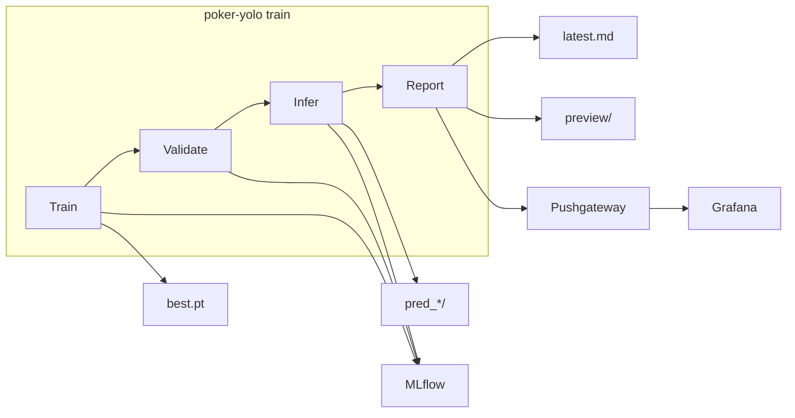

# Poker YOLO — детекция игральных карт

Проект — **сквозной пайплайн** на **Ultralytics YOLOv8** для детекции **52 классов** игральных карт (отдельная карта = один класс). Цель, метрики успеха и контекст задачи — в [TASK.md](TASK.md).

**Полный цикл `train`** (скачивание датасета с Kaggle, подготовка YOLO-разметки, обучение, валидация, инференс, отчёт, опционально MLflow и Pushgateway) задуман для запуска **в Docker** с GPU на хосте. Локально удобно использовать **`validate`**, **`infer`** и **`poker-hand`**, когда веса и данные уже есть.

---

## Содержание

- [CLI](#cli)
- [Быстрый старт](#быстрый-старт)
- [Архитектура](#архитектура)
- [Компоненты](#компоненты)
- [Конфигурации](#конфигурации)
- [Метрики при обучении (оффлайн)](#метрики-при-обучении-оффлайн)
- [Просмотр результатов](#просмотр-результатов)
- [Отдельные команды](#отдельные-команды)
- [Docker](#docker)
- [Тесты](#тесты)
- [Структура каталогов](#структура-каталогов)
- [Troubleshooting](#troubleshooting)

---

## CLI

Утилита: `poker-yolo`. Глобальный аргумент **`--config`** задаёт YAML (по умолчанию ищется `configs/default.yaml` или `/app/configs/default.yaml` в контейнере). Подкоманда — обязательна.

| Подкоманда | Назначение |
|------------|------------|
| `train` | Train → validate → infer → отчёт (основной сценарий в Docker) |
| `validate` | Только валидация по разметке (нужен `best.pt` или `--weights`) |
| `infer` | Только инференс по `--source` (нужны веса) |

**Рекомендуемый вызов в Docker** (порядок аргументов фиксированный):

```bash
docker compose run --rm poker-yolo --config configs/local.yaml train
```

Локально, без полного Kaggle-пайплайна (нужны уже подготовленные данные и веса):

```bash
uv run poker-yolo --config configs/local.yaml validate --weights path/to/best.pt
uv run poker-yolo --config configs/local.yaml infer --weights path/to/best.pt --source path/to/images
```

Флаги **`train`**: `--skip-infer`, `--infer-source DIR`, `--no-save`.

---

## Быстрый старт

### 1. Репозиторий и зависимости

```bash
git clone <URL> poker-yolo && cd poker-yolo
uv sync
```

При первом обращении к базовой модели Ultralytics подтянет веса (например `yolov8n.pt`, порядка нескольких мегабайт).

### 2. Окружение для Docker

```bash
cp .env.example .env
```

Заполните **`KAGGLE_USERNAME`** и **`KAGGLE_KEY`** (или положите `kaggle.json` в каталог из **`KAGGLE_CONFIG_DIR`**). Compose подставляет `.env` в сервисы и в контейнер `poker-yolo`.

### 3. Данные

| Путь | Роль |
|------|------|
| `dataset/test/` | Бенчмарк «руки» (Roboflow), команда `poker-hand`, конфиг `configs/hands.yaml` |
| `dataset/kaggle/` | Обучение YOLO: создаётся **в контейнере** при первом обращении к `train`/`validate`/`infer` с Kaggle-конфигом; данные лежат в volume **`kaggle_data`** |

YAML с Kaggle-датасетом: `configs/default.yaml`, `configs/local.yaml`, `configs/smoke.yaml`.

### 4. Сервисы (MLflow и опционально observability)

```bash
docker compose up -d mlflow
docker compose --profile observability up -d
```

| Сервис | URL (порты из `.env`) |
|--------|------------------------|
| MLflow | `http://localhost:${MLFLOW_PORT:-5000}` |
| Grafana | `http://localhost:${GRAFANA_PORT:-3001}` (логин в `.env`) |
| Preview отчётов | `http://localhost:${REPORT_SERVER_PORT:-8088}/preview/` |
| Prometheus | `http://localhost:${PROMETHEUS_PORT:-9090}` |

### 5. Обучение в Docker

```bash
docker compose up -d mlflow
docker compose build poker-yolo

# 10 эпох — разработка
docker compose run --rm poker-yolo --config configs/local.yaml train

# 50 эпох — полный прогон
docker compose run --rm poker-yolo --config configs/default.yaml train

# Smoke на CPU в контейнере
docker compose run --rm -e REQUIRE_CUDA=0 poker-yolo --config configs/smoke.yaml train
```

После успеха в логах будет блок **«Pipeline complete — where to view results»**. Каталог **`./runs`** на хосте смонтирован в контейнер — веса, отчёты и логи остаются у вас на диске.

## Архитектура



1. **Train** — YOLOv8 + встроенные аугментации + Albumentations из конфига.  
2. **Validate** — отдельный прогон `model.val()` на сплите из YAML (`validate.split`, по умолчанию `val`).  
3. **Infer** — `model.predict()` по `infer.source` (в рабочих конфигах — каталог `dataset/`).  
4. **Report** — Markdown/JSON, preview, при наличии URL — Pushgateway.

---

## Компоненты

| Модуль | Роль |
|--------|------|
| `cli.py` | Парсер CLI, оркестрация `train` / `validate` / `infer` |
| `train.py` | Вызов `YOLO.train()`, MLflow, снятие ресурсов после эпохи |
| `validate.py` | `YOLO.val()`, извлечение box-метрик, MLflow |
| `infer.py` | `YOLO.predict()`, латентность и FPS по батчу кадров |
| `callbacks.py` | Логирование **поэпоховых** метрик Ultralytics в MLflow и в отчёт |
| `augmentations.py` | Параметры аугментаций для YOLO и Albumentations |
| `monitoring.py` | CPU/RAM/GPU, сводка по датасету, эвристика аугментаций, production KPI |
| `predictions.py` | Несколько размеченных превью для отчёта |
| `reporting.py` | JSON/Markdown, Pushgateway |
| `mlflow_utils.py` | Эксперимент, параметры, метрики, артефакты |
| `kaggle_dataset.py` | Скачивание и конвертация Kaggle → YOLO |
| `config.py` / `device.py` | YAML и выбор устройства |
| `hands.py` / `detect_hand_cli.py` | Покерная комбинация по 5 картам на фото |

Инфраструктура: `Dockerfile`, `docker-compose.yml`, `scripts/entrypoint.sh`, `observability/`.

---

## Конфигурации

| Файл | Эпохи | Device | MLflow URI в YAML | Назначение |
|------|-------|--------|-------------------|------------|
| `configs/smoke.yaml` | 3 | cpu | localhost | Быстрая проверка пайплайна |
| `configs/local.yaml` | 10 | auto | localhost | Короткие прогоны |
| `configs/default.yaml` | 50 | auto | сервис `mlflow` в Docker | Основное обучение |
| `configs/hands.yaml` | — | auto | localhost | Только `poker-hand` / `dataset/test` |

Секции YAML (смысловые блоки):

```yaml
data:          # yaml_path, dataset_root
model:         # weights, imgsz
train:         # epochs, batch, device, workers, project/name, …
augmentations: # mosaic, mixup, albumentations, …
validate:      # metric_conf, iou, split
infer:         # conf, iou, save_dir, source
mlflow:        # tracking_uri, experiment_name
reporting:     # log_dir, report_dir, pushgateway_url, preview_samples, …
```

### Переменные окружения

Шаблон: **`.env.example`**. Используются **Docker Compose** (`env_file`, подстановка `${VAR}` в `docker-compose.yml`). Основные переменные: `KAGGLE_USERNAME`, `KAGGLE_KEY`, `KAGGLE_CONFIG_DIR`, `MLFLOW_TRACKING_URI`, `PROMETHEUS_PUSHGATEWAY_URL`, `REPORTS_BASE_URL`, `NVIDIA_*`, `POKER_YOLO_DEVICE`, `REQUIRE_CUDA`, порты `*_PORT`.

### Артефакты после `train`

| Что | Где |
|-----|-----|
| Веса | `runs/detect/runs/train/<name>/weights/best.pt` |
| CSV эпох Ultralytics | `runs/detect/runs/train/<name>/results.csv` |
| Выход инференса | `runs/infer/pred_<timestamp>/` |
| Отчёт | `runs/reports/latest.md`, `latest.json` |
| Preview | `runs/reports/preview/sample_*.jpg` |
| JSONL-логи | `runs/logs/poker-yolo.jsonl` |

---

## Метрики при обучении

### 1. Метрики детекции (COCO-style, Ultralytics)

Они приходят из объекта результатов **`results.box`** после `train` / `val`:

| Имя в коде / отчёте | Смысл |
|---------------------|--------|
| **`map50`** | mAP@0.5 — средняя точность по IoU=0.5 по классам |
| **`map50_95`** (в логах Ultralytics часто как `map`) | mAP@[0.5:0.95] — среднее по порогам IoU от 0.5 до 0.95 с шагом 0.05 |
| **`precision`** (`mp` в Ultralytics) | Средняя macro-precision по классам на валидации |
| **`recall`** (`mr` в Ultralytics) | Средняя macro-recall по классам |
| **`f1`** | Не из API напрямую: **\(2 \cdot P \cdot R / (P + R)\)** из macro precision/recall, если \(P+R>0\) |

Порог **уверенности для расчёта метрик валидации** задаётся в YAML как **`validate.metric_conf`** (в коде — `val_metric_conf`): слишком высокий порог «обрежет» слабые детекции и может занулить метрики на дашбордах. Порог **NMS IoU** — **`validate.iou`**.

После обучения в отчёт дополнительно попадают **`train_map50`**, **`train_map50_95`**, **`train_precision`**, **`train_recall`**, если Ultralytics вернул их в `results.box` у финального объекта train.

В **MLflow** при логировании результатов валидации/обучения дополнительно могут уйти **per-class mAP**: `class_map_0`, `class_map_1`, … (если у `box` заполнен `maps`).

### 2. Метрики по эпохам во время `train`

Колбэк **`on_train_epoch_end` / `on_fit_epoch_end`** снимает **`trainer.metrics`** у Ultralytics: все пары ключ–значение с числовыми значениями (типично **train loss** по компонентам `box_loss`, `cls_loss`, `dfl_loss`, иногда валидационные метрики за эпоху — как именует сам тренер). Они:

- пишутся в событие отчёта **`train.epoch`**;
- при активном MLflow — логируются как **`epoch_<имя_метрики>`** с `step = epoch`.

Точный набор ключей зависит от версии Ultralytics и флагов обучения; первичный источник правды по кривым — **`results.csv`** в каталоге рана.

### 3. Метрики инференса

После `predict` по каталогу/файлам:

| Метрика | Определение |
|---------|-------------|
| **`infer_latency_ms`** | \(1000 \cdot T / N\) — среднее время на одно изображение, мс |
| **`infer_fps`** | \(N / T\) — кадров в секунду по всему батчу |
| **`infer_images`** | \(N\) — число обработанных изображений |

`T` — wall-clock время прохода, `N` — `len(results)`.

### 4. Ресурсы и production KPI (оффлайн-мониторинг)

**`ResourceMonitor`** в фазах train/val периодически снимает:

- **`cpu_pct`**, **`ram_mb`** (psutil);
- **`gpu_util_pct`**, **`gpu_mem_mb`** (CUDA + по возможности NVML).

В сводку попадают **средние и пиковые** значения с префиксом фазы, например: `train_cpu_avg_pct`, `train_ram_peak_mb`, `val_gpu_mem_peak_mb`, `val_resource_samples`, и т.д.

**`compute_dataset_stats`** — по `data.yaml`: число изображений в train/val/test, число классов, имена классов.

**`compute_augmentation_summary`** — эвристика: доли mosaic/mixup/…, оценка **`synthetic_to_real_ratio`**, **`estimated_augmented_views_per_epoch`** (для отчётов, не отдельная метрика качества модели).

**`compute_production_metrics`** агрегирует длительности **`train_duration_sec`**, **`val_duration_sec`**, **`infer_duration_sec`**, **`pipeline_duration_sec`**, размер весов **`model_size_mb`**, плюс перечисленные val/infer метрики и ресурсы — всё это попадает в блок **production** финального JSON/Markdown и при наличии — в Pushgateway.

### 5. Preview на фиксированных тест-картинках

Для превью в отчёте запускается короткий **`predict`** на случайной подвыборке из **`test`** в `data.yaml` с **`conf = validate.metric_conf`**. В JSON отчёта — **число детекций**, классы, bbox, уверенность по каждому боксу (это не усреднённые метрики mAP, а **пример** на конкретных кадрах).

---

## Просмотр результатов

### Отчёт на диске

```bash
type runs\reports\latest.md
# или
cat runs/reports/latest.md
```

### MLflow

UI: **`http://localhost:<MLFLOW_PORT>`** (в Docker контейнере трекинг по умолчанию на `http://mlflow:5000`). Эксперимент из конфига (`experiment_name`).

### Grafana

Дашборд **Poker YOLO — Training and Inference** (после `docker compose --profile observability up`). Метрики попадают, если Pushgateway был доступен во время финализации отчёта.

---

## Отдельные команды

```bash
uv run poker-yolo --config configs/local.yaml validate \
  --weights runs/detect/runs/train/poker_cards/weights/best.pt

uv run poker-yolo --config configs/local.yaml infer \
  --weights runs/detect/runs/train/poker_cards/weights/best.pt \
  --source dataset/test/images
```

Без **`--weights`** CLI ищет `best.pt` в `runs/detect/runs/train/<name>/weights/`.

### Покерная комбинация на фото

```bash
uv run poker-hand
uv run poker-hand --image dataset/test/images/test_1.jpg
uv run python scripts/detect_poker_hand.py --seed 42
```

---

## Docker

Образ: **Python 3.11 (bookworm)** + зависимости через **`uv`**, PyTorch с CUDA в wheel, драйвер GPU — на хосте ([NVIDIA Container Toolkit](https://docs.nvidia.com/datacenter/cloud-native/container-toolkit/install-guide.html); в Docker Desktop включите GPU).

```bash
docker compose up -d mlflow
docker compose --profile observability up -d   # по желанию
docker compose build poker-yolo

docker compose run --rm poker-yolo resolve-device
docker compose run --rm poker-yolo check-gpu
```

Сервис **`poker-yolo`**: `gpus: all`, увеличенный **`shm_size`** (см. Troubleshooting) для DataLoader. Entrypoint принимает только формат **`… poker-yolo --config <yaml> train|validate|infer`** и внутри вызывает `poker-yolo` с тем же списком аргументов.

---

## Тесты

```bash
uv sync --group dev
uv run pytest
```

Интеграционные проверки Pushgateway помечены **`@pytest.mark.integration`**.

---

## Структура каталогов

```
.
├── poker_yolo/
├── configs/
├── dataset/              # test/ в репозитории; kaggle/ в контейнере + volume
├── observability/
├── scripts/
├── tests/
├── Dockerfile
├── docker-compose.yml
├── pyproject.toml
├── uv.lock
├── TASK.md
└── README.md
```

В **`.gitignore`**: `runs/`, `mlruns/`, `.venv/`, крупные веса и кэши — не коммитьте артефакты обучения.

---

## Troubleshooting

| Симптом | Что сделать |
|---------|-------------|
| Нет GPU, `device: auto` | Будет **CPU** |
| Обязателен GPU | `REQUIRE_CUDA=1` в окружении `docker compose run` |
| Проверка GPU | `docker compose run --rm poker-yolo check-gpu` |
| MLflow не отвечает | `docker compose up -d mlflow` или смена `MLFLOW_TRACKING_URI` |
| Pushgateway 400 | Перезапуск stack; см. код дедупликации метрик |
| Нули в val на дашбордах | Уменьшите **`validate.metric_conf`** в YAML (например `0.001`) |
| Нет `best.pt` | Путь: `runs/detect/runs/train/<name>/weights/` |
| **`unable to allocate shared memory (shm)`** или зависание после 1-й эпохи | В compose для `poker-yolo` задан **`shm_size: 8gb`**; перезапустите `docker compose run`. Запасной вариант — **`train.workers: 0`** в YAML |
| Тесты «висят» | Не указывайте `PROMETHEUS_PUSHGATEWAY_URL` на недоступный хост |

---
