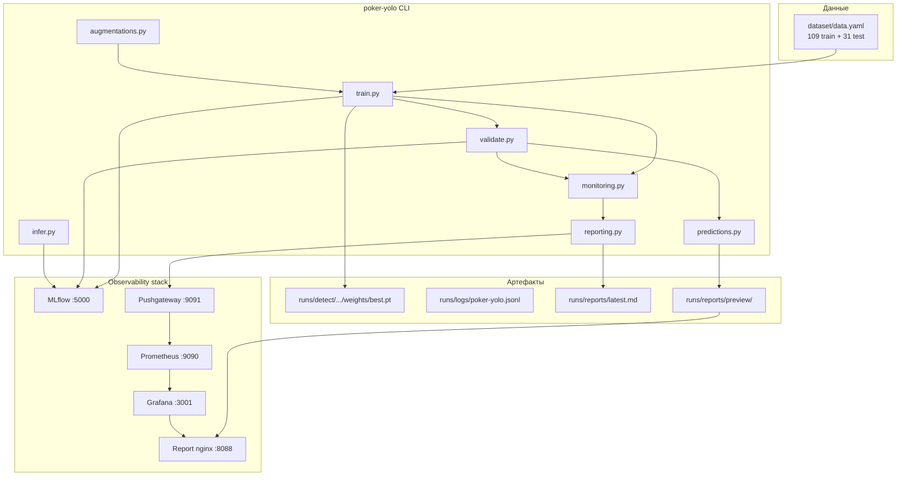

# Poker YOLO — детекция игральных карт

End-to-end пайплайн на **YOLOv8** для обнаружения и классификации 52 классов игральных карт. Включает обучение, валидацию, инференс, логирование в MLflow, структурированные отчёты и опциональный стек observability (Prometheus + Grafana).

Подробное описание задачи и целевых метрик — в [TASK.md](TASK.md).

---

## Содержание

- [Архитектура](#архитектура)
- [Компоненты проекта](#компоненты-проекта)
- [Требования](#требования)
- [Быстрый старт на новом ПК](#быстрый-старт-на-новом-пк)
- [Запуск обучения](#запуск-обучения)
- [Валидация и инференс](#валидация-и-инференс)
- [Конфигурации](#конфигурации)
- [MLflow — просмотр экспериментов](#mlflow--просмотр-экспериментов)
- [Grafana и отчёты](#grafana-и-отчёты)
- [Docker](#docker)
- [Тесты](#тесты)
- [Структура каталогов](#структура-каталогов)
- [Troubleshooting](#troubleshooting)

---

## Архитектура



**Поток команды `train`:**

1. Загрузка конфига YAML → старт отчёта (`reporting.py`)
2. Обучение YOLOv8 с on-the-fly аугментациями (YOLO + Albumentations)
3. Сэмплирование CPU/RAM/GPU во время train (`monitoring.py`)
4. Автоматическая пост-train валидация на test split
5. Экспорт 3 preview-изображений с детекциями (`predictions.py`)
6. Финальный отчёт: JSON, Markdown, Prometheus → `runs/reports/`
7. Логирование метрик и артефактов в MLflow

---

## Компоненты проекта

| Компонент | Путь / сервис | Назначение |
|-----------|---------------|------------|
| CLI | `poker_yolo/cli.py` | Точка входа: `train`, `validate`, `infer` |
| Обучение | `poker_yolo/train.py` | Ultralytics YOLOv8 + MLflow callbacks |
| Валидация | `poker_yolo/validate.py` | mAP, Precision, Recall, F1 на test |
| Инференс | `poker_yolo/infer.py` | Предсказания на файлах/папках |
| Аугментации | `poker_yolo/augmentations.py` | Mosaic/MixUp + Albumentations |
| Мониторинг | `poker_yolo/monitoring.py` | CPU/GPU/RAM, статистика аугментаций |
| Preview | `poker_yolo/predictions.py` | 3 аннотированных примера для отчётов |
| Отчёты | `poker_yolo/reporting.py` | JSON / MD / Prometheus + Pushgateway |
| MLflow | `poker_yolo/mlflow_utils.py` | Эксперименты, параметры, метрики, веса |
| Конфиги | `configs/*.yaml` | Параметры train/val/infer/reporting |
| Датасет | `dataset/` | YOLO-разметка, 52 класса |
| Docker | `Dockerfile`, `docker-compose.yml` | Контейнер пайплайна + MLflow + Grafana |
| Observability | `observability/` | Prometheus, Grafana dashboards, nginx |

---

## Требования

### Локальная разработка

| Требование | Версия |
|------------|--------|
| Python | ≥ 3.11 |
| [uv](https://docs.astral.sh/uv/) | последняя |
| Git | любая актуальная |
| GPU (опционально) | CUDA + драйвер NVIDIA |

### Docker (полный стек)

- Docker Desktop / Docker Engine
- Docker Compose v2
- Для GPU в контейнере: [NVIDIA Container Toolkit](https://docs.nvidia.com/datacenter/cloud-native/container-toolkit/install-guide.html)

---

## Быстрый старт на новом ПК

### 1. Клонировать репозиторий

```bash
git clone <URL-репозитория> poker-yolo
cd poker-yolo
```

### 2. Проверить датасет

Датасет включён в репозиторий (`dataset/`, ~75 MB). Если каталога нет — экспортируйте YOLOv8-датасет из [Roboflow](https://roboflow.com) и распакуйте в `dataset/`. Структура:

```
dataset/
  data.yaml
  train/images/   train/labels/
  test/images/    test/labels/
```

> **Важно:** в `dataset/data.yaml` не должно быть строки `path: .` — пути задаются относительно расположения файла.

### 3. Установить зависимости

```bash
# Windows (PowerShell) / Linux / macOS
uv sync
```

При первом запуске Ultralytics автоматически скачает базовые веса `yolov8n.pt` (~6 MB).

### 4. Проверить пайплайн (smoke test, ~5 мин на CPU)

```bash
uv run poker-yolo --config configs/smoke.yaml train
```

### 5. Поднять MLflow (локально или через Docker)

**Вариант A — Docker (рекомендуется):**

```bash
docker compose up -d mlflow
```

**Вариант B — без Docker:**

```bash
uv run mlflow server --host 127.0.0.1 --port 5000 \
  --backend-store-uri sqlite:///mlruns/mlflow.db \
  --default-artifact-root mlruns/artifacts
```

### 6. (Опционально) Observability stack

```bash
docker compose --profile observability up -d
```

| Сервис | URL | Логин |
|--------|-----|-------|
| MLflow | http://localhost:5000 | — |
| Grafana | http://localhost:3001 | admin / admin |
| Prometheus | http://localhost:9090 | — |
| Pushgateway | http://localhost:9091 | — |
| Preview-изображения | http://localhost:8088/preview/ | — |

### 7. Полное обучение

```bash
# Локально (используйте configs/local.yaml для localhost MLflow)
uv run poker-yolo --config configs/local.yaml train

# Или полный прогон 50 эпох
uv run poker-yolo --config configs/default.yaml train
```

На машине **без GPU** `device: auto` автоматически переключается на `cpu`.

---

## Запуск обучения

```bash
uv run poker-yolo --config configs/default.yaml train
```

Команда `train` выполняет **обучение + валидацию + финальный отчёт** за один запуск.

### Что создаётся после train

| Артефакт | Путь |
|----------|------|
| Лучшие веса | `runs/detect/runs/train/poker_cards/weights/best.pt` |
| CSV метрик | `runs/detect/runs/train/poker_cards/results.csv` |
| Структурированный лог | `runs/logs/poker-yolo.jsonl` |
| Отчёт (Markdown) | `runs/reports/latest.md` |
| Отчёт (JSON) | `runs/reports/latest.json` |
| Prometheus metrics | `runs/reports/latest.prom` |
| Preview (3 img) | `runs/reports/preview/sample_{0,1,2}.jpg` |

### Переменные окружения

| Переменная | Описание | Пример |
|------------|----------|--------|
| `MLFLOW_TRACKING_URI` | URI MLflow (перекрывает YAML) | `http://localhost:5000` |
| `PROMETHEUS_PUSHGATEWAY_URL` | Pushgateway для Grafana | `http://localhost:9091` |

---

## Валидация и инференс

### Валидация

```bash
uv run poker-yolo --config configs/local.yaml validate \
  --weights runs/detect/runs/train/poker_cards/weights/best.pt
```

Если `--weights` не указан, CLI ищет `best.pt` в стандартных путях (`runs/train/...` и `runs/detect/runs/train/...`).

### Инференс

```bash
uv run poker-yolo --config configs/local.yaml infer \
  --weights runs/detect/runs/train/poker_cards/weights/best.pt \
  --source dataset/test/images
```

Опции:

- `--source` — файл, папка или glob
- `--no-save` — не сохранять аннотированные изображения

Результаты: `runs/infer/pred_<timestamp>/`

---

## Конфигурации

| Файл | Назначение |
|------|------------|
| `configs/default.yaml` | Полное обучение: 50 эпох, все аугментации |
| `configs/local.yaml` | Локальная разработка: 10 эпох, MLflow на localhost |
| `configs/smoke.yaml` | Smoke test: 3 эпохи, CPU, быстрая проверка CI |

Ключевые секции YAML:

```yaml
data:          # пути к data.yaml и корню датасета
model:         # yolov8n.pt, imgsz
train:         # epochs, batch, device, lr, project/name
augmentations: # mosaic, mixup, albumentations
validate:      # conf, iou, split
infer:         # conf, iou, save_dir
mlflow:        # tracking_uri, experiment_name
reporting:     # log_dir, report_dir, pushgateway_url, preview_samples
```

---

## MLflow — просмотр экспериментов

1. Убедитесь, что MLflow запущен (`docker compose up -d mlflow` или локальный сервер).
2. Откройте **http://localhost:5000**
3. Выберите эксперiment **`poker-yolo`**
4. В каждом run доступны:
   - **Parameters** — epochs, batch, mosaic, mixup, albumentations и др.
   - **Metrics** — `train_map50`, `val_map50`, epoch losses (через callbacks)
   - **Artifacts** — `best.pt`, `results.csv`, конфиг

### MLflow в Docker

При запуске через `docker compose run poker-yolo train` URI уже настроен:

```
MLFLOW_TRACKING_URI=http://mlflow:5000
```

---

## Grafana и отчёты

### Markdown / JSON отчёты

После каждого `train` / `validate` / `infer` создаётся отчёт в `runs/reports/`:

```bash
# Windows
type runs\reports\latest.md

# Linux/macOS
cat runs/reports/latest.md
```

Отчёт включает:

- **Metrics** — mAP@0.5, F1, Precision, Recall
- **Resource Usage** — CPU/RAM/GPU (avg/peak) на train и val
- **Augmentation Statistics** — synthetic/real ratio, вероятности трансформов
- **Sample Predictions** — 3 примера с URL на preview
- **Production Metrics** — duration, model size, throughput

### Grafana dashboard

1. Запустите observability stack:

   ```bash
   docker compose --profile observability up -d
   ```

2. Откройте **http://localhost:3001** (admin / admin)

3. Dashboard: **Poker YOLO — Training and Inference**
   (`/d/poker-yolo-main/poker-yolo-training-and-inference`)

4. Панели:
   - mAP, F1, Precision, Recall
   - CPU/RAM train vs val
   - Augmentation ratio
   - Train/val duration
   - 3 image panels (preview с детекциями)

> Метрики попадают в Grafana через Pushgateway → Prometheus. Push происходит автоматически при `finalize_report()`, если `pushgateway_url` задан в конфиге или через `PROMETHEUS_PUSHGATEWAY_URL`.

### Preview-изображения

После train nginx (profile `observability`) раздаёт:

- http://localhost:8088/preview/sample_0.jpg
- http://localhost:8088/latest.md

---

## Docker

### Только MLflow

```bash
docker compose up -d mlflow
```

### Train в контейнере

```bash
docker compose build poker-yolo
docker compose run --rm poker-yolo train --config configs/default.yaml
```

### GPU в Docker

Раскомментируйте секцию `deploy.resources` в `docker-compose.yml` для сервиса `poker-yolo` и установите NVIDIA Container Toolkit.

### Полный стек

```bash
docker compose --profile observability up -d
docker compose run --rm poker-yolo train --config configs/default.yaml
```

---

## Тесты

```bash
uv sync --group dev
uv run pytest
```

60 тестов: конфиг, аугментации, CLI, pipeline (mocked YOLO), reporting, monitoring, predictions.

---

## Структура каталогов

```
.
├── poker_yolo/           # Python-пакет пайплайна
├── configs/              # YAML-конфиги
├── dataset/              # YOLO датасет (train/test)
├── observability/        # Prometheus, Grafana, nginx
├── scripts/              # entrypoint.sh, run_full_train.ps1
├── tests/                # pytest
├── Dockerfile
├── docker-compose.yml
├── pyproject.toml
├── uv.lock               # зафиксированные версии зависимостей
├── TASK.md               # постановка задачи и метрики
└── README.md             # это руководство
```

**Не коммитится** (см. `.gitignore`): `runs/`, `mlruns/`, `.venv/`, `*.pt`, кэши.

---

## Troubleshooting

| Проблема | Решение |
|----------|---------|
| `device=auto` без GPU | Автоматически → `cpu`; или явно `device: cpu` в YAML |
| MLflow недоступен | `docker compose up -d mlflow` или `MLFLOW_TRACKING_URI=file:///./mlruns` |
| Grafana пустая | Запустите observability profile; выполните train после старта Pushgateway |
| Веса не найдены | Проверьте `runs/detect/runs/train/<name>/weights/best.pt` |
| Ultralytics сохраняет не туда | Ultralytics пишет в `runs/detect/runs/train/`, не в `runs/train/` |
| Нет места на диске C: (Windows) | Перенесите TEMP/кэш на другой диск: `$env:TEMP="D:\tmp"` |
| Тесты зависают | Убедитесь, что `PROMETHEUS_PUSHGATEWAY_URL` не указывает на недоступный хост |

---

## Публикация в Git

```bash
git init
git add .
git status          # убедитесь: нет runs/, .venv/, *.pt
git commit -m "Initial commit: YOLOv8 poker card detection pipeline"
git remote add origin <URL>
git push -u origin main
```

> Датасет помечен как **Private** в Roboflow. Перед публикацией в публичный репозиторий убедитесь, что у вас есть право на распространение данных.
